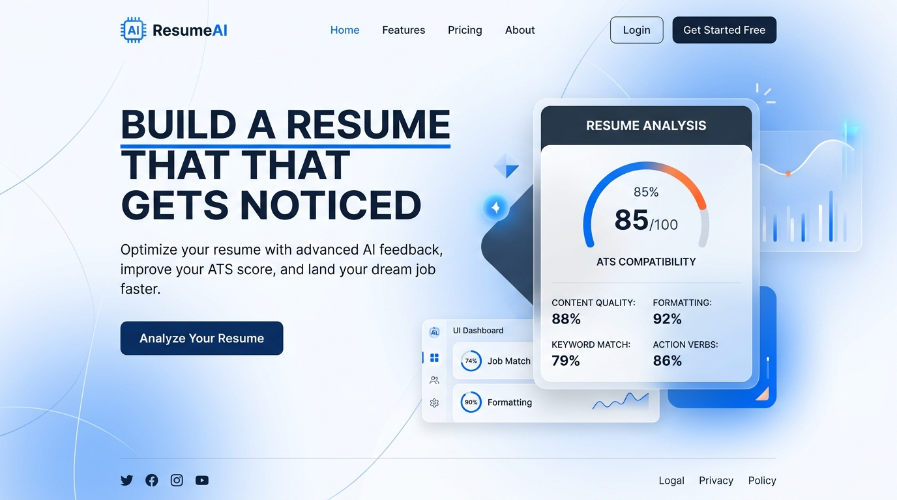
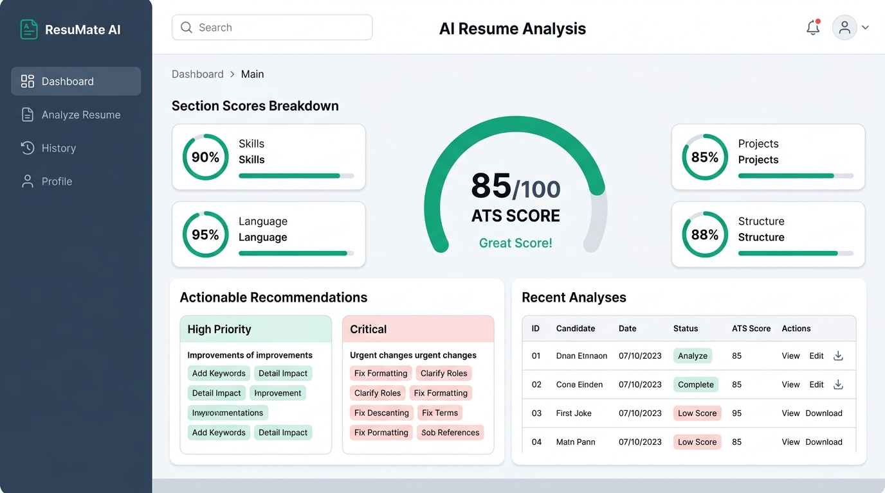

# ResumeAI — AI Resume Analysis SaaS Platform

> **Status:** 🚧 **Work in Progress (WIP)** — *Active Development & Beta Integration. Not yet final release.*

An enterprise-ready, AI-driven resume scoring and ATS optimization SaaS platform. It combines deterministic section parsing, **Ollama** semantic skill alignment, **LanguageTool** writing hygiene diagnostics, and a responsive **Next.js 16 (App Router + React 19)** SaaS frontend.

---

## 📸 Preview & Screenshots

### 1. SaaS Landing Page


### 2. AI Analysis & ATS Scoring Dashboard


---

## ⚡ Key Highlights & Features

- **Single Source of Truth**: Backend handles all parsing, AI evaluation, and scoring. Frontend renders results cleanly without duplicating business logic.
- **Deterministic ATS Scoring Formula**: Section-by-section evaluation across Structure, Contact completeness, Skills, Projects, Education, Experience, Certifications, and Language.
- **Project ↔ Skill Alignment**: Uncovers whether skills claimed in the Technical Skills section are legitimately proven in real-world project deliverables.
- **LanguageTool Writing Diagnostics**: Deep grammar, spelling, typography, and phrasing issue detection with actionable replacement suggestions.
- **Prioritized Recommendations**: Advice categorized by impact (*Critical*, *High*, *Medium*, *Optimization*) to directly boost interview callback rates.
- **Session Authentication & Protection**: HTTP-only cookie JWT auth (`accessToken`) with automated session recovery (`/api/v1/auth/me`) and protected route guards.
- **Multi-Stage Processing Visualizer**: Animated progress tracker reflecting backend OCR, section parsing, Ollama semantic analysis, and grammar checking.
- **Client-Side Analysis History**: Searchable history with score badges, cached analysis inspection, and printable report views.

---

## 🏗️ System Architecture

The application is structured into two completely decoupled services:

```text
AI-Resume-Analysis/
│
├── backend/                  # Express.js, PostgreSQL (Prisma), Ollama, LanguageTool
│   ├── src/
│   │   ├── controllers/      # auth.controller, analyze.controller
│   │   ├── routes/           # /api/v1/auth, /api/v1/analyze
│   │   ├── services/         # ollama, grammar, section-detector, scoring...
│   │   └── middlewares/      # authMiddleware, uploadMiddleware (PDF only, 5MB)
│   └── package.json
│
├── frontend/                 # Next.js 16 (App Router), React 19, Tailwind CSS v4
│   ├── src/
│   │   ├── app/              # (auth), dashboard, pricing, page.tsx
│   │   ├── components/       # analysis/, auth/, dashboard/, layout/
│   │   ├── context/          # AuthContext (session state)
│   │   ├── lib/api/          # axios client, typed auth and resume methods
│   │   └── types/            # Complete TypeScript schema contracts
│   └── package.json
│
├── docs/images/              # UI previews & screenshots
└── docker-compose.yml        # LanguageTool container
```

---

## 📡 API Endpoints & Contracts

| Endpoint | Method | Description | Auth Required |
| :--- | :--- | :--- | :--- |
| `/api/v1/auth/register` | `POST` | Registers new user (`email`, `password`) | No |
| `/api/v1/auth/login` | `POST` | Authenticates user and sets HTTP-only cookie | No |
| `/api/v1/auth/me` | `GET` | Validates session and returns current user | Yes (`authMiddleware`) |
| `/api/v1/auth/logout` | `POST` | Clears authentication cookie | Yes (`authMiddleware`) |
| `/api/v1/analyze` | `POST` | Multipart PDF upload (field: `resume`, max 5MB) | No |

---

## 🚀 Getting Started

### Prerequisites
- **Node.js**: v20+
- **Docker**: For running LanguageTool
- **Ollama**: Running locally or remotely (default: `http://localhost:11434`, model: `llama3.2:3b`)
- **PostgreSQL**: NeonDB or local instance

---

### 1. Start LanguageTool Service
```bash
docker compose up -d
```
LanguageTool will run on `http://localhost:8081`.

---

### 2. Backend Setup
```bash
cd backend
npm install

# Configure environment variables (.env)
# PORT=5000
# DATABASE_URL=your_postgres_connection_string
# allowedOrigins=http://localhost:3000,http://localhost:3001
# JWT_SECRET=your-secret-key
# OLLAMA_URL=http://localhost:11434
# OLLAMA_MODEL=llama3.2:3b
# LANGUAGE_TOOL_URL=http://localhost:8081

npm run dev
```
Backend runs on `http://localhost:5000`.

---

### 3. Frontend Setup
```bash
cd frontend
npm install

# Configure environment variables (.env.local)
# NEXT_PUBLIC_API_URL=http://localhost:5000/api/v1

npm run dev
```
Open `http://localhost:3000` to access the SaaS application.

---

## 🛠️ Tech Stack

- **Frontend**: Next.js 16, React 19, TypeScript, Tailwind CSS v4, Axios, React Hook Form, Zod, Lucide Icons.
- **Backend**: Express.js, TypeScript, PostgreSQL, Prisma Next, PDFParse, Tesseract.js (OCR fallback).
- **AI & NLP**: Ollama (`llama3.2:3b`), LanguageTool (grammar/spell checking container).

---

## 📌 Development Notice

> **Note:** This project is actively being developed and is currently in a preliminary **Work in Progress (WIP)** state. Some UI flows, additional backend history persistence models, and automated email recovery workflows are slated for future releases.
